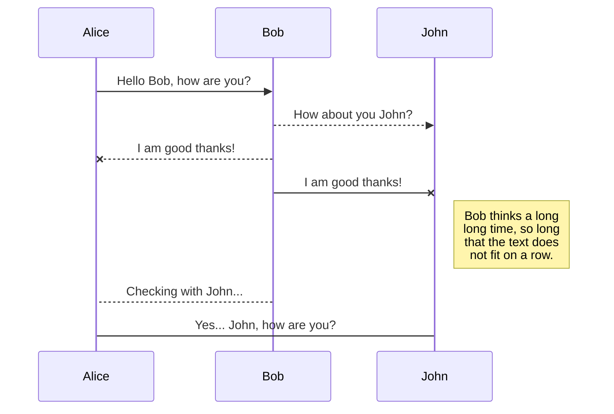
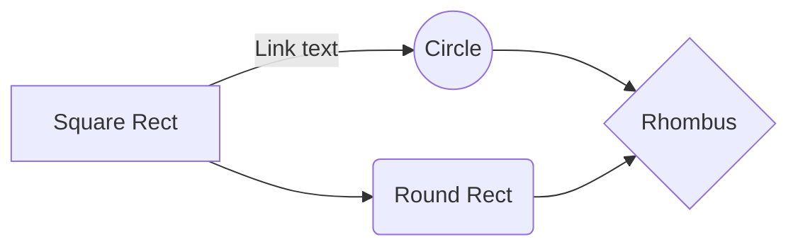

# Welcome to Problem One!

**Problema 1:** Diseñe un algoritmo que, dado un número real que entra como dato, nos indique si está contenido dentro de los límites predeterminados. El límite inferior es de 100 y el superior de 200.

# Restricciones: 

Uso de las estructuras de selección if-then-else

**Datos de Entrada:**
		Números de tipo real
		
**Datos de Salida:**
		Mensaje de que está dentro de los límites, mensaje de que está fuera de lo rango o no alcanza 
		
## Algoritmo
Inicio
	Limite_Inferior = 100
	Limite_Superior = 200
	Solicitar número al usuario.
	Almaceno en mi variable Número
	Si Número es mayor o igual que Limite_Inferior entonces
		Si Número es menor o igual que
		Limite_superior entonces
			Imprimo en pantalla que está dentro de 
			los limites
			Sino
			Imprimo en pantalla que supera al limite
			Máximo
			Sino
				Imprimo en pantalla que que no alcanza el 
				limite mínimo
				Fin

# Código en C

    #include <stdio.h>
    #include <conio.h>
    #define Limite_Inferior 100 #define Limite_Superior 200
	int main ()
	{
		float Numero=0; //Definimos nuestra variable 
		printf(“--Problema1--\n”); 
		printf(“Introduzca un número: ”);
		scanf(“%f”, &Numero);
		if (Numero >= Limite_Inferior)
		 {
			if (Numero <= Limite_Superior) 
			{
			printf(“Está dentro del intervalo”); 
			}
		else
			printf(“Supera el límite máximo ”
		}
		else
			printf("No alcanza el límite mínimo");
		return 0;
	}			

	
## Publish a File

You can publish your file by opening the **Publish** sub-menu and by clicking **Publish to**. For some locations, you can choose between the following formats:

- Markdown: publish the Markdown text on a website that can interpret it (**GitHub** for instance),
- HTML: publish the file converted to HTML via a Handlebars template (on a blog for example).

## Update a publication

After publishing, StackEdit keeps your file linked to that publication which makes it easy for you to re-publish it. Once you have modified your file and you want to update your publication, click on the **Publish now** button in the navigation bar.

> **Note:** The **Publish now** button is disabled if your file has not been published yet.

## Manage file publication

Since one file can be published to multiple locations, you can list and manage publish locations by clicking **File publication** in the **Publish** sub-menu. This allows you to list and remove publication locations that are linked to your file.

# Markdown extensions

StackEdit extends the standard Markdown syntax by adding extra **Markdown extensions**, providing you with some nice features.

> **ProTip:** You can disable any **Markdown extension** in the **File properties** dialog.

## SmartyPants

SmartyPants converts ASCII punctuation characters into "smart" typographic punctuation HTML entities. For example:

|                |ASCII                          |HTML                         |
|----------------|-------------------------------|-----------------------------|
|Single backticks|`'Isn't this fun?'`            |'Isn't this fun?'            |
|Quotes          |`"Isn't this fun?"`            |"Isn't this fun?"            |
|Dashes          |`-- is en-dash, --- is em-dash`|-- is en-dash, --- is em-dash|

## KaTeX

You can render LaTeX mathematical expressions using [KaTeX](https://khan.github.io/KaTeX/):

The *Gamma function* satisfying $\Gamma(n) = (n-1)!\quad\forall n\in\mathbb N$ is via the Euler integral

$$
\Gamma(z) = \int_0^\infty t^{z-1}e^{-t}dt\,.
$$

> You can find more information about **LaTeX** mathematical expressions [here](http://meta.math.stackexchange.com/questions/5020/mathjax-basic-tutorial-and-quick-reference).

## UML diagrams

You can render UML diagrams using [Mermaid](https://mermaidjs.github.io/). For example, this will produce a sequence diagram:

And this will produce a flow chart:

